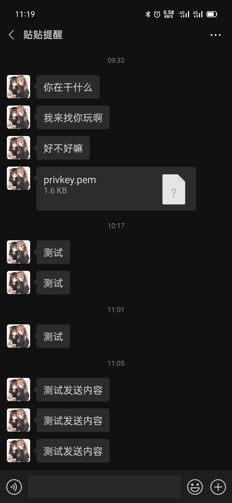
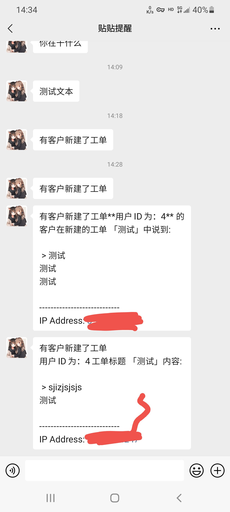

# wechatsendmsg
自己搞一个类似server酱企业微信通道, php版本, 仅一个文件, 放到网站根目录然后请求接口就可以发送消息  
兼容server酱接口只需要把原有https://sc.ftqq.com/xxx.send 改为http://example.com/wechatsendmsg.php  

和Server酱的区别  
Server酱每天仅可推送 500 条消息(Turbo版仅免费5条)  
并且在1分钟内不能推送相同消息，而自己搭建的则没有任何限制  
Server酱只能推送消息给某一个人，企业微信搭建的可以多个人，并能设置更多的权限  

企业微信应用消息：无需安装企业微信客户端，可在微信中直接收到消息，内容显示全文, 具体效果看截图  

# 注册企业微信
注册企业微信：参考教程，这里不再赘述  
https://jingyan.baidu.com/article/2c8c281d65dc670009252a57.html  
注册好企业微信 https://work.weixin.qq.com  
进入管理后台-->选择应用管理-->选择创建应用-->填写应用名称  
创建好后，得到 AgentId 和 Secret 两个值  
回到企业微信后台，选择我的企业，翻到最底下，得到企业 ID  

# 修改参数
将wechatsendmsg.php的企业id, 应用id, 应用secret, 用户id (也就是用户账号，多个用户用|符号分开) 替换成自己的

# 运行方式
wechatsendmsg.php支持三种运行模式

# 命令行cli模式(供测试使用):
php wechatsendmsg.php 发送内容

# php-fpm模式:
将wechatsendmsg.php放在网站public根目录  
get方式访问接口  
http://example.com/wechatsendmsg.php?text=测试文本  
post方式访问接口   
header类型: (Content-type: application/x-www-form-urlencoded)  
参数: text 内容: 测试文本  
http://example.com/wechatsendmsg.php  

# 效果图

# 常见问题
怎么在微信接受消息?  
在企业微信设置里面取消仅企业微信接受消息选项  

如何兼容原有server酱接口?  
兼容server酱接口只需要把原有https://sc.ftqq.com/xxx.send 改为http://example.com/wechatsendmsg.php  
